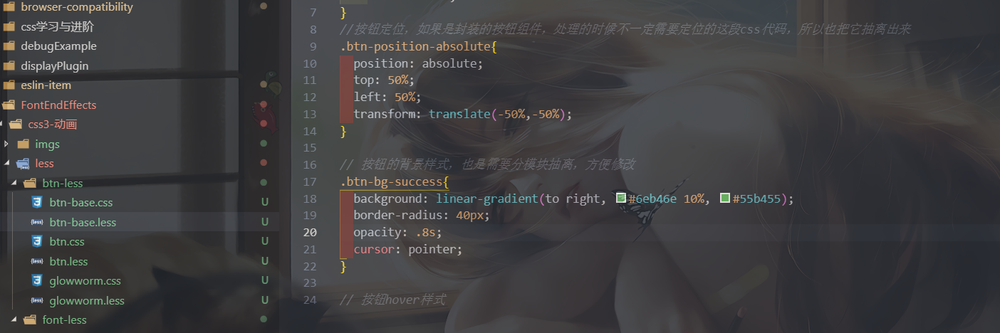
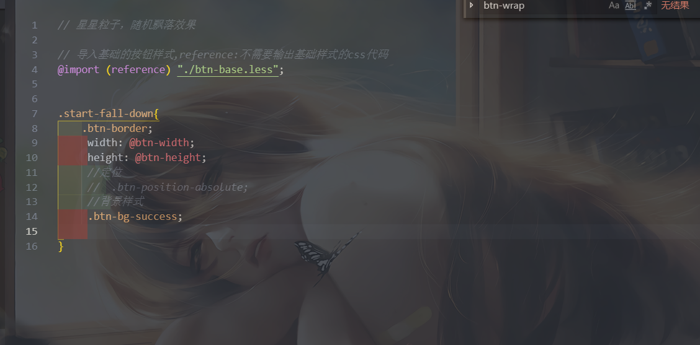
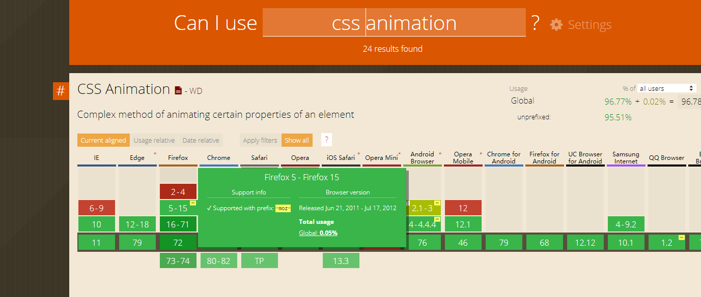

### 本项目是一些常用css3动画的实现
 主要是`文字类型动画`、`按钮组件动画`、`3d动画`、`css3曲线、形状绘制`、`加载动画` `css3波浪动画` `随机动画` `背景叠加动画` `svg形状动画` `css border-radius 模拟贝塞尔曲线` `css3 3d特效`

### 写在前面
<i>所有的例子css部分都使用less开发，基于less模块化开发css;</i>

<i> 部分案例的动画组件都会涉及到一些非动画的基础样式，比如按钮。开发过程个人将这些基础样式独立写于xx-base.less，不混入各自动画样式.less中;</i>

#### 部分兼容性问题
<i>由于使用css3实现，项目中部分例子仍然无法兼容版本低于10的ie浏览器，比如背景样式渐变，所以所有设置背景颜色渐变的还会提供一个不带渐变的颜色作为在不兼容浏览器的显示</i>

<i>使用到filter也就是css3滤镜属性：ie浏览器不支持。</i>

<i>background-clip:text; 根据文字裁剪文字所在元素的背景,只有chrome浏览器支持</i>

**开发阶段工程截图**




**展示截图**


### 简单使用说明

1. 具体使用可以参考`index.html`里面有动画的相关使用demo，建议可以直接clone到本地后或者是直接下载dist压缩包到本地使用，根据示例修改使用。所有动画几乎都是使用css实现，项目中使用less开发css，所以具体的效果修改可以直接修改对应的less文件。
   ps:`index.html`为了排版，每个动画案例都会有一个额外的div包裹层，实际的动画特效模板不包含包裹层，可以根据自己的需要灵活使用。`index.html`内联式css代码只是排版，与动画无关，不额外建立一个css文件是为了区分没有给独立引入的动画样式。

2. example：

   > 比如使用3d旋转图集，
   >
   > - 对应`less/animation-3d/rotate3d-imgs.less`,根据自己需要修改大小等变量，后编译成css文件引入
   >
   > - 对应的html模板如下：
   >
   >   ```html
   >   
   >   ```

3. 特殊说明

   > `樱花花瓣随机飘落`该随机动画需要js的配合，所以效果实现还需要引入对应的js文件，如下:
   > 引入:`./js/cherryFalldown.js`
   >
   > 使用：
   >
   > ```js
   >  // 樱花花瓣随机飘落特效--参数
   >         let option = {
   >             width: 60,
   >             height: 33,
   >             baseImgSrc: './less/cherry-blossoms-falling/imgs/',
   >             imgs: ['1.png', '2.png', '3.png', '4.png', '5.png', '6.png'],
   >             lineNUm: 3,
   >             minSpeed: 30,
   >             maxSpeed: 80
   >         }
   >         // 樱花花瓣随机飘落特效--方法调用
   >         cherryFalldownEffect(option)
   > ```

### css3动画介绍
1. css3动画特点
> 页面交互效果绚丽、一定程度可以提高应用性能(只有在特定的一个前提，可以自行参考Chromium的css渲染机制)、实现起来比较简单，降低js业务逻辑代码复杂度
2. css3动画缺点
> 动画过程控制薄弱,无法附加绑定回调函数，CSS3动画只能暂停，不能在动画中寻找一个特定的事件点，不能在半路反转动画，不能变换事件尺度，不能在特定的位置添加回调函数或是绑定回放事件，无进度报告。
3. 应用场景
> 应用中需要一些特效来优化交互体验，但是动画不是核心，也没有那么复杂，只是涉及简单状态的切换，不需要中间过程控制。
4. css3动画的实现
   - 涉及几个比较核心的css3属性
 `transition` `animation` `transform` `transform-oringin`
   - 动画的实现方式
    ##### 单纯使用`transition`过渡实现部分相对简单不涉及循环播放动画的案例(业务)
    ##### 使用`animation`实现比较复杂带循环、同个元素多个css属性（一个元素需要切换几种状态过渡）需要实现动画的案例(业务)。合理利用`animation`很多复杂的动画可以不需要借助js实现，单纯通过css3即可实现，再加上它可以调用。
5. 项目动画的类型标签
    `2d动画` `3d动画` `交错动画` `随机动画`
6. 动画文件的取名划分
> 本来是想根据仅仅涉及效果，可以封装成css模块复用、带动画的组件来进行划分，但是后来还是考虑纠结了好久，还是应为业务、技术的薄弱问题。
> 所以目前的划分就是 **封装动画的组件类型**比如悬浮菜单，3d相册... **常用css3动画特效代码类型**比如淡入淡出、右移动进入
7. 兼容性考虑
css3部分属性需要加前缀，但是随着有些浏览器版本升级，已经可以不需要前缀便可以支持像`transiton`、`transform`等属性了。
当然不同用户浏览器类型不同、版本不同，我这里使用vscoe自动补充前缀插件——`Autoprefixer` 配置它在哪些类型的浏览器加上前缀，这个一般是感觉项目需求。
```json
" > 5% ",
"ie > 8", 
"firefox >= 5",
"chrome >= 4",
"Opera >=12.1",
"Safari >=4"
```

