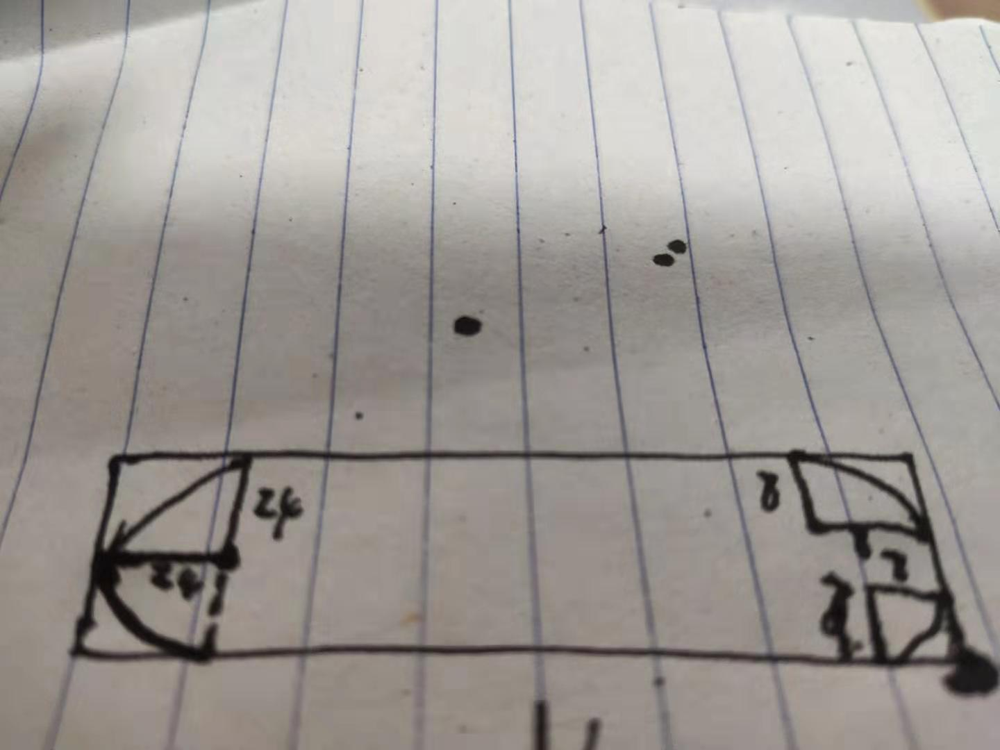
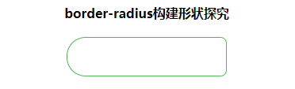
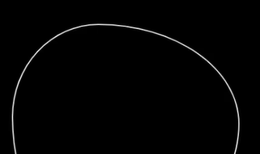

<!--
 * @Description: 
 * @version: 
 * @Author: 
 * @LastEditors: lxw
 * @LastEditTime: 2020-02-20 20:09:27
 -->
这一部分是属于`曲线`、`波浪`、`css绘制各种形状`、`css模拟贝塞尔曲线`、`svg贝塞尔曲线实现波浪效果`

### 关于波浪的抽象：很多的波浪效果其本质就是一个不规则盒子的运动造成的视觉误差加上给盒子设置背景颜色再把border给去掉就只剩形状盒子的运动。其实本质是它的border设置成奇怪的曲线形状，再给盒子加上背景，加上一些移动的动画比如旋转，（如果它把border再去掉就更看不出来了）视觉上就形成了波浪效果。波浪形状来源于border-radius。所以对于部分动画化动为静、正确的抽象它的实现本质可以得出更简单的实现方案。

核心:`border-radius`的使用
1. 属性说明
```css
border-radius：3px,展开属性如下
border-top-left-radius:3px;
border-top-right-radius:3px;
border-bottom-right-radius:3px;
border-bottom-left-radius:3px;
```
2. 计算准则：四个方向，四段弧形、每段弧形的垂直半径、水平半径、当div是正方形且每段弧形的垂直半径=水平半径且各自相等的时候形成圆形、隐藏边框
3. 特点：水平垂直半径决定了上下两条边框的曲线程度(是否能达到不带直线完全是曲线，)。而竖直垂直半径决定了左右两条边框曲线程度
4. 个人觉得如果是需要借助border-radius实现一些比较复杂点的曲线或者是不规则形状，需要考虑到border-radius四个属性值的，使用border-radius的完整写法会更容易实现一点，也更容易理解
5. 关于border-radius的完整写法
```css
border-radius: 1-4 length|% / 1-4 length|%;
````
我们平常写的border-radius: 50px，其实完整写法应该是:

```css
border-radius : 50px 50px 50px 50px / 50px 50px 50px 50px;

```
'/'前面四个数值分别代表左上、右上、右下、坐下四个圆角的水平半径，后面则是垂直半径，如实下实践图，我自己实现类似一个这样的边框形状的样式
也是可以比较形象地说明如何通过上面对border-radius属性的搭配来实现我们需要的边框形状。



刨析:
```
下面的盒子尺寸: 200px * 48px，边框形状特点：左边是半圆，右边是两个圆角
首先左边实现半圆：首先高度必须要大于等于盒子高度的一半这里左边（上下的水平、垂直半径我们就设置：24px）右边就是简单给个8px吧就实现了。
若是遇到比较复杂的同样可以按照这个思路进行拆分化解
- 如果一条边框已经是完全的曲线了考虑该边框对应的半径（比如上边框对应是左水平半径 + 右水平半径之和）之和一定满足大于等于盒子的宽度。如下形状
```


只考虑上边框曲线的话，大概的比例是这样的
```css
border-radius: 37% 63% xx xx / 41% 44% xx xx
```


代码
```css
 .ex1{
            width: 200px;
            height: 48px;
            border: 1px solid #55b455;
            border-radius: 24px 8px 8px 24px / 24px 8px 8px 24px;
        }
````
